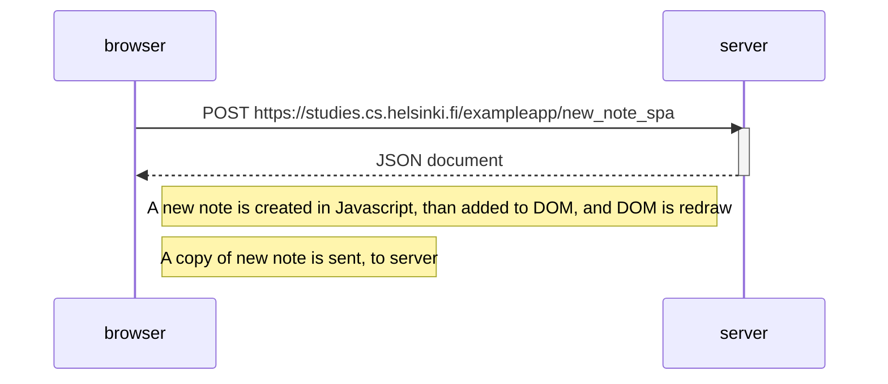

```mermaid
sequenceDiagram
    participant browser
    participant server

    browser->>server: POST https://studies.cs.helsinki.fi/exampleapp/new_note_spa
    activate server
    server-->>browser: JSON document
    deactivate server
    
    Note right of browser: A new note is created in Javascript, than added to DOM, and DOM is redraw
    Note right of browser: A copy of new note is sent, to server
```
